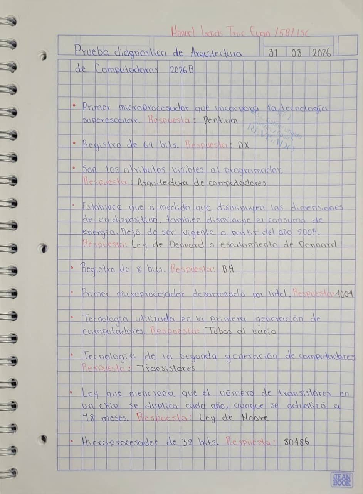
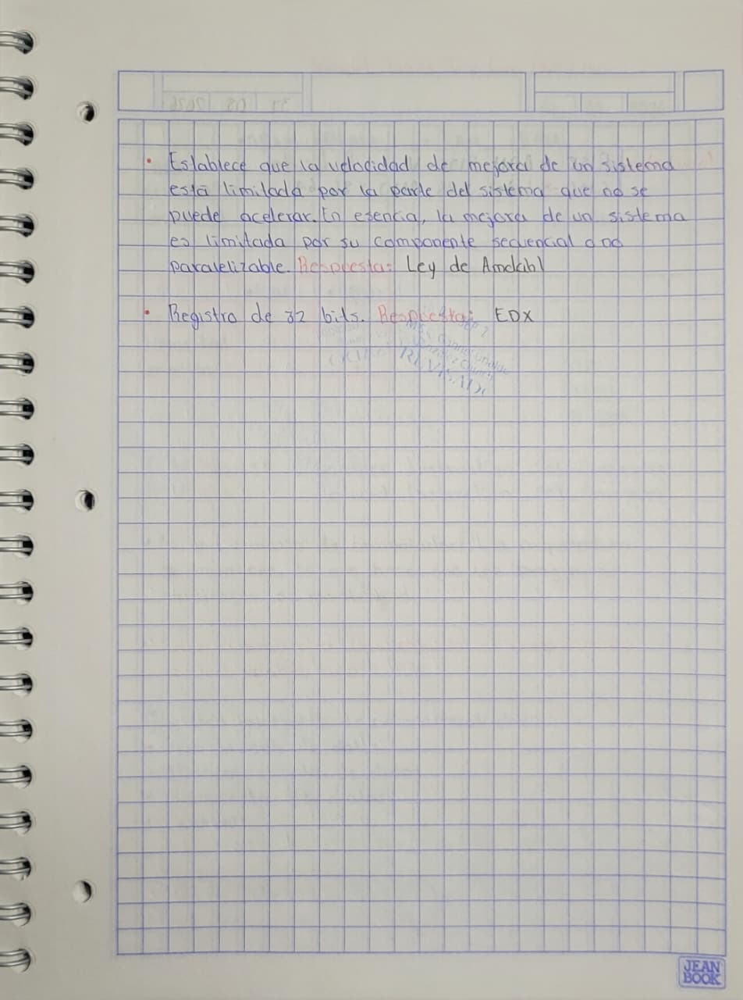
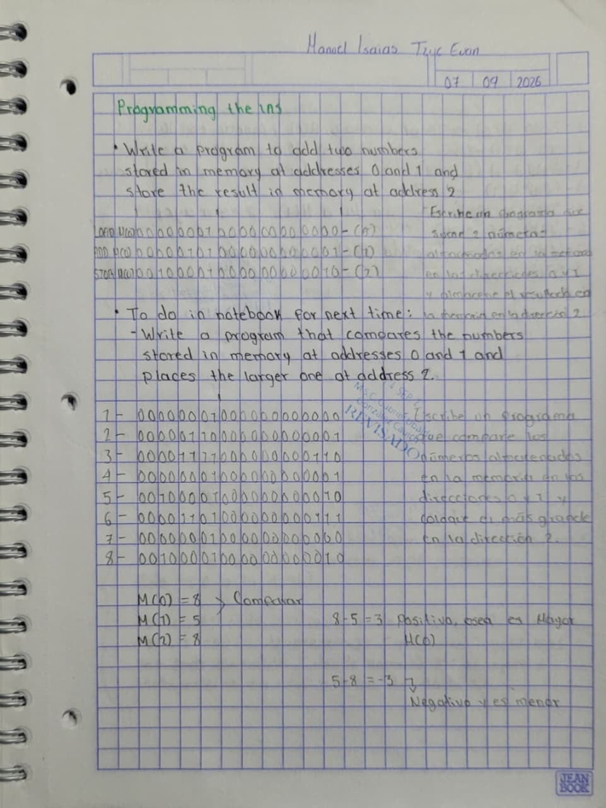
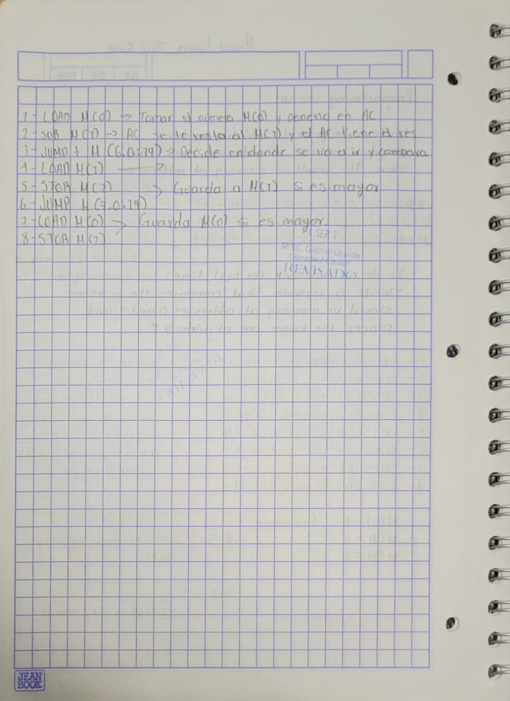
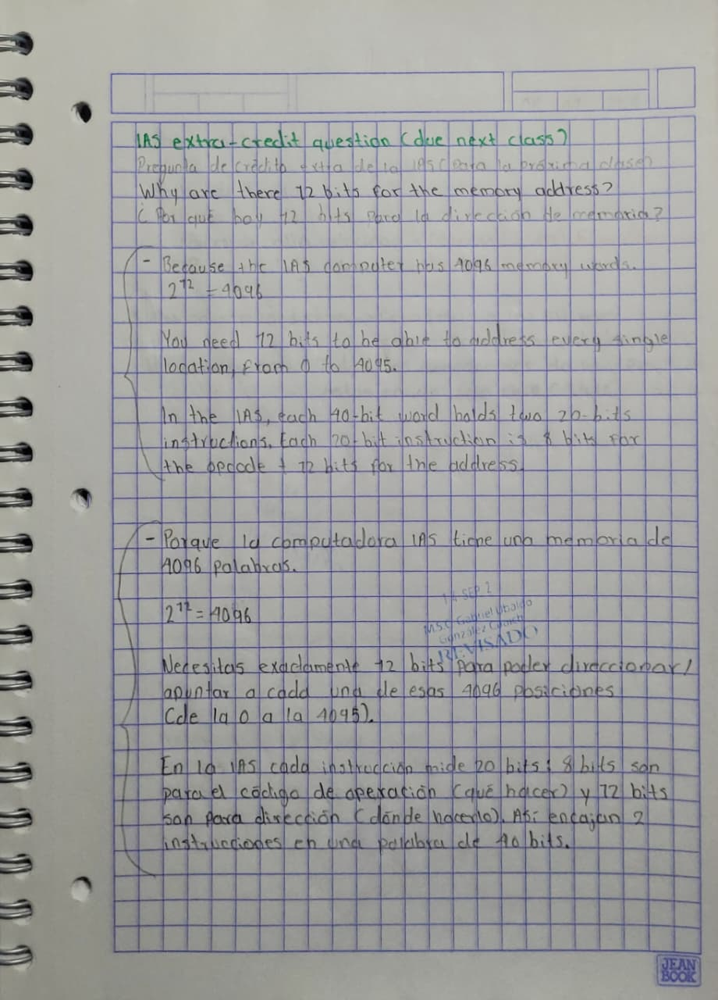

# PORTAFOLIO DE EVIDENCIAS

## Arquitectura de Computadoras

**Nombre del alumno:** Manuel Isaias Tzuc Euan 

**Asignatura:** Arquitectura de Computadoras  

**Docente:** I.S.C. Gabriel Ubaldo González Cauich  

**Institución:** TecNM Campus Motul 

**Semestre:** 5

**Grupo:** B

**Unidad:** 1

**Periodo:** 2026B

El objetivo de este portafolio es recopilar y organizar los trabajos realizados durante este parcial mediante evidencias mostrando los conocimientos y aprendizajes obtenidos en cada una de las actividades así como una reflexión de aprendizaje y un análisis de errores y propuesta de mejora para cada una.

---
## Índice

1. [Prueba Diagnóstica](#1-prueba-diagnóstica)
2. [Programming the IAS](#2-programming-the-ias)
3. [IAS extra-credit question (due next class)](#3-ias-extra-credit-question-due-next-class)
4. [Mapa conceptual de las arquitecturas de cómputo](#4-mapa-conceptual-de-las-arquitecturas-de-cómputo)
5. [Análisis de la Ley de Moore](#5-análisis-de-la-ley-de-moore)
6. [Reporte de práctica](#6-reporte-de-práctica)

---

---

## 1. Prueba Diagnóstica

### Descripción de la actividad

En esta actividad se realizó una prueba diagnóstica con el propósito de identificar los conocimientos previos relacionados con la asignatura de Arquitectura de Computadoras.

### Evidencia fotográfica

### Reflexión de aprendizaje

En esta actividad pude identificar los conocimientos que ya tenía sobre los temas relacionados con la arquitectura de computadoras y también reconocer aquellos aspectos que necesitaba reforzar, algo bueno de esta evaluación diagnóstica fue que más allá de solo ver los errores pude responder el cuestionario hasta tener las respuestas correctas y así poder tener más conocimiento.

### Análisis de errores y propuesta de mejora

Al realizar la prueba diagnóstica pude identificar algunos temas en los que tuve dificultades. Para mejorar, considero necesario repasar los conceptos vistos en clase, consultar el material de apoyo y practicar con diferentes ejercicios para fortalecer mis conocimientos, incluso para mejorar específicamente esos conocimientos que me fueron difíciles puedo revisar las preguntas con las respuestas correctas que copié en mi libreta como se muestra en la evidencia.

---

## 2. Programming the IAS

### Descripción de la actividad

En esta actividad trabajé con la arquitectura IAS (Institute for Advanced Study) y aprendí cómo se organizan y ejecutan sus instrucciones. Algo que me llamó la atención es que una palabra de memoria de la IAS tiene 40 bits y puede contener dos instrucciones de 20 bits cada una.

Cada instrucción de 20 bits se divide en dos partes. Los primeros 8 bits corresponden al código de operación (opcode), que indica qué operación debe realizar la computadora, mientras que los otros 12 bits corresponden a la dirección, que indica en qué posición de memoria se encuentra el dato que se va a utilizar.

De esta manera, una palabra de 40 bits puede guardar dos instrucciones, y cada una tiene sus propios 8 bits para indicar la operación y 12 bits para indicar la dirección. Durante la actividad pude observar cómo estas instrucciones se van tomando de la memoria y ejecutando de acuerdo con lo que indican. Esto me ayudó a entender mejor cómo una computadora puede almacenar las instrucciones y después utilizarlas para realizar diferentes operaciones.

### Evidencia fotográfica

### Reflexión de aprendizaje

En esta actividad apliqué la teoría de funcionamiento explicada por el profesor en clase para entenderla mejor, fue muy interesante entender como funcionaba la computadora IAS la cual teniá una arquitectura que funcionaba con la arquitectura de von Neumann.

### Análisis de errores y propuesta de mejora

Durante la actividad tuve algunas dificultades para comprender correctamente las instrucciones y el funcionamiento de la arquitectura IAS. Para mejorar, considero que necesito practicar más con los ejercicios y revisar paso a paso cómo se ejecuta cada instrucción. Practicar me ayudaría a hacerlo más rápido ya que tardé en hacerlos, debido a que me daba miedo escribir el código de operación de manera errónea o bien usar la incorrecta.

---

## 3. IAS extra-credit question (due next class)

### Descripción de la actividad

En esta actividad realicé una pregunta extra relacionada con la arquitectura IAS, con la intención de reforzar lo que había aprendido sobre la forma en que trabaja esta computadora. Para resolverla tuve que investigar un poco más por mi cuenta.

Al realizar esta actividad pude relacionar estos conceptos con los ejercicio anteriores y entender mejor que las instrucciones tienen una estructura específica que permite al procesador saber qué debe hacer y con qué información debe trabajar.

### Evidencia fotográfica

### Reflexión de aprendizaje

Esta actividad me ayudó a complementar lo que ya había visto sobre la arquitectura IAS. Pude comprender mejor el motivo de las 12 direcciones de memoria.

### Análisis de errores y propuesta de mejora
En esta ocasión al ser una investigación corta no tuve situaciones adversas para realizar esta actividad.

