# PORTAFOLIO DE EVIDENCIAS

## Arquitectura de Computadoras

**Nombre del alumno:** Manuel Isaias Tzuc Euan 

**Asignatura:** Arquitectura de Computadoras  

**Docente:** I.S.C. Gabriel Ubaldo González Cauich  

**Institución:** TecNM Campus Motul 

**Semestre:** 5

**Grupo:** B

**Unidad:** 1

**Periodo:** 2026B

---
## Índice
[Introducción](#introdicción) 

[Objetivo](#objetivo)
1. [Prueba Diagnóstica](#1-prueba-diagnóstica)
2. [Programming the IAS](#2-programming-the-ias)
3. [IAS extra-credit question (due next class)](#3-ias-extra-credit-question-due-next-class)
4. [Mapa conceptual de las arquitecturas de cómputo](#4-mapa-conceptual-de-las-arquitecturas-de-cómputo)
5. [Análisis de la Ley de Moore](#5-análisis-de-la-ley-de-moore)
6. [Reporte de práctica](#6-reporte-de-práctica)

[Reflexión final](#reflexión-final)

[Conclusión](#conclusión)

---
## Introducción
El presente portafolio de evidencias reúne las diferentes actividades que realicé durante la primera unidad de la asignatura de Arquitectura de Computadoras. A lo largo de esta unidad trabajé con diferentes temas relacionados con la forma en que funcionan y se organizan las computadoras, comenzando con una prueba diagnóstica para identificar mis conocimientos previos y continuando con actividades relacionadas con la arquitectura IAS, las arquitecturas de cómputo, la Ley de Moore y el funcionamiento de una memoria RAM estática 6116.

Cada una de las actividades me permitió aprender de una manera diferente. Algunas fueron principalmente de investigación y análisis, mientras que otras me ayudaron a aplicar lo aprendido mediante ejercicios o una práctica física. Por ejemplo, al trabajar con la arquitectura IAS pude conocer mejor la estructura de sus instrucciones y la forma en que se almacenan en memoria. También, mediante el mapa conceptual, pude organizar y relacionar las características de diferentes arquitecturas de cómputo. Por otra parte, el análisis de la Ley de Moore me permitió conocer mejor la evolución de los procesadores y, finalmente, la práctica con la memoria RAM 6116 me permitió observar de manera más directa cómo se realizan operaciones de escritura y lectura de datos.

Las evidencias de cada actividad están en este portafolio donde se incluyen reflexiones sobre los aprendizajes obtenidos y un análisis de los errores o dificultades que se presentaron. Esto permite no solo mostrar los trabajos realizados, sino también reconocer qué aspectos comprendí mejor y cuáles necesito seguir practicando. El portafolio representa el trabajo realizado durante la unidad y el aprendizaje que fui obteniendo a lo largo de las actividades.

---
## Objetivo
El objetivo de este portafolio es recopilar y presentar de manera organizada las actividades realizadas durante la primera unidad de la asignatura de Arquitectura de Computadoras, mostrando los conocimientos y aprendizajes que fui adquiriendo durante el desarrollo de cada una.

También se busca reflejar el proceso que seguí para comprender los diferentes temas vistos en clase, desde el reconocimiento de mis conocimientos previos mediante la prueba diagnóstica, hasta la realización de actividades relacionadas con la arquitectura IAS, las arquitecturas de cómputo, la Ley de Moore y la memoria RAM estática 6116. A través de estas actividades pude relacionar algunos conceptos teóricos con ejercicios y situaciones prácticas.

Otro de los objetivos es identificar las dificultades que se presentaron durante el desarrollo de los trabajos y analizar qué puedo hacer para mejorar. De esta forma, el portafolio no solo sirve como una recopilación de evidencias, sino también como una manera de reflexionar sobre mi propio aprendizaje y reconocer los temas que necesito seguir reforzando.

---

## 1. Prueba Diagnóstica

### Descripción de la actividad

En esta actividad se realizó una prueba diagnóstica con el propósito de identificar los conocimientos previos relacionados con la asignatura de Arquitectura de Computadoras.

### Evidencia fotográfica

### Reflexión de aprendizaje

En esta actividad pude identificar los conocimientos que ya tenía sobre los temas relacionados con la arquitectura de computadoras y también reconocer aquellos aspectos que necesitaba reforzar, algo bueno de esta evaluación diagnóstica fue que más allá de solo ver los errores pude responder el cuestionario hasta tener las respuestas correctas y así poder tener más conocimiento.

### Análisis de errores y propuesta de mejora

Al realizar la prueba diagnóstica pude identificar algunos temas en los que tuve dificultades. Para mejorar, considero necesario repasar los conceptos vistos en clase, consultar el material de apoyo y practicar con diferentes ejercicios para fortalecer mis conocimientos, incluso para mejorar específicamente esos conocimientos que me fueron difíciles puedo revisar las preguntas con las respuestas correctas que copié en mi libreta como se muestra en la evidencia.

---

## 2. Programming the IAS

### Descripción de la actividad

En esta actividad trabajé con la arquitectura IAS (Institute for Advanced Study) y aprendí cómo se organizan y ejecutan sus instrucciones. Algo que me llamó la atención es que una palabra de memoria de la IAS tiene 40 bits y puede contener dos instrucciones de 20 bits cada una.

Cada instrucción de 20 bits se divide en dos partes. Los primeros 8 bits corresponden al código de operación (opcode), que indica qué operación debe realizar la computadora, mientras que los otros 12 bits corresponden a la dirección, que indica en qué posición de memoria se encuentra el dato que se va a utilizar.

De esta manera, una palabra de 40 bits puede guardar dos instrucciones, y cada una tiene sus propios 8 bits para indicar la operación y 12 bits para indicar la dirección. Durante la actividad pude observar cómo estas instrucciones se van tomando de la memoria y ejecutando de acuerdo con lo que indican. Esto me ayudó a entender mejor cómo una computadora puede almacenar las instrucciones y después utilizarlas para realizar diferentes operaciones.

### Evidencia fotográfica

### Reflexión de aprendizaje

En esta actividad apliqué la teoría de funcionamiento explicada por el profesor en clase para entenderla mejor, fue muy interesante entender como funcionaba la computadora IAS la cual teniá una arquitectura que funcionaba con la arquitectura de von Neumann.

### Análisis de errores y propuesta de mejora

Durante la actividad tuve algunas dificultades para comprender correctamente las instrucciones y el funcionamiento de la arquitectura IAS. Para mejorar, considero que necesito practicar más con los ejercicios y revisar paso a paso cómo se ejecuta cada instrucción. Practicar me ayudaría a hacerlo más rápido ya que tardé en hacerlos, debido a que me daba miedo escribir el código de operación de manera errónea o bien usar la incorrecta.

---

## 3. IAS extra-credit question (due next class)

### Descripción de la actividad

En esta actividad realicé una pregunta extra relacionada con la arquitectura IAS, con la intención de reforzar lo que había aprendido sobre la forma en que trabaja esta computadora. Para resolverla tuve que investigar un poco más por mi cuenta.

Al realizar esta actividad pude relacionar estos conceptos con los ejercicio anteriores y entender mejor que las instrucciones tienen una estructura específica que permite al procesador saber qué debe hacer y con qué información debe trabajar.

### Evidencia fotográfica

### Reflexión de aprendizaje

Esta actividad me ayudó a complementar lo que ya había visto sobre la arquitectura IAS. Pude comprender mejor el motivo de las 12 direcciones de memoria.

### Análisis de errores y propuesta de mejora
En esta ocasión al ser una investigación corta no tuve situaciones adversas para realizar esta actividad.

---

## 4. Mapa conceptual de las arquitecturas de cómputo

### Descripción de la actividad

En esta actividad realicé un mapa conceptual sobre las diferentes arquitecturas de cómputo. El propósito fue organizar y relacionar los conceptos principales de una manera más visual para poder entender mejor las características de cada arquitectura.

En el mapa conceptual incluí información sobre las arquitecturas y los elementos que las distinguen, como la forma en que se organizan y procesan las instrucciones y los datos. También pude relacionar los conceptos vistos en clase con ejemplos, lo que me ayudó a comprender mejor las diferencias entre las arquitecturas.

### Evidencia fotográfica

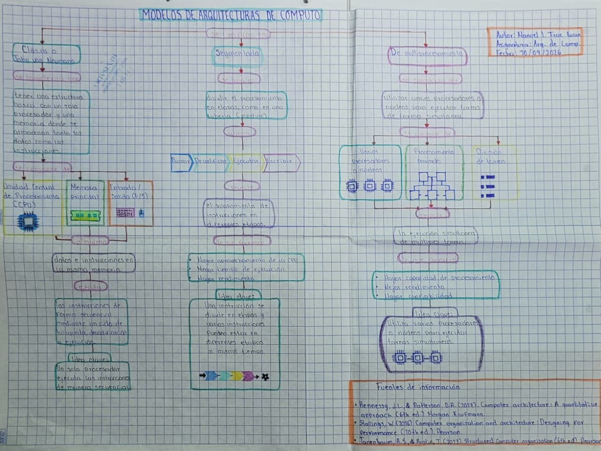

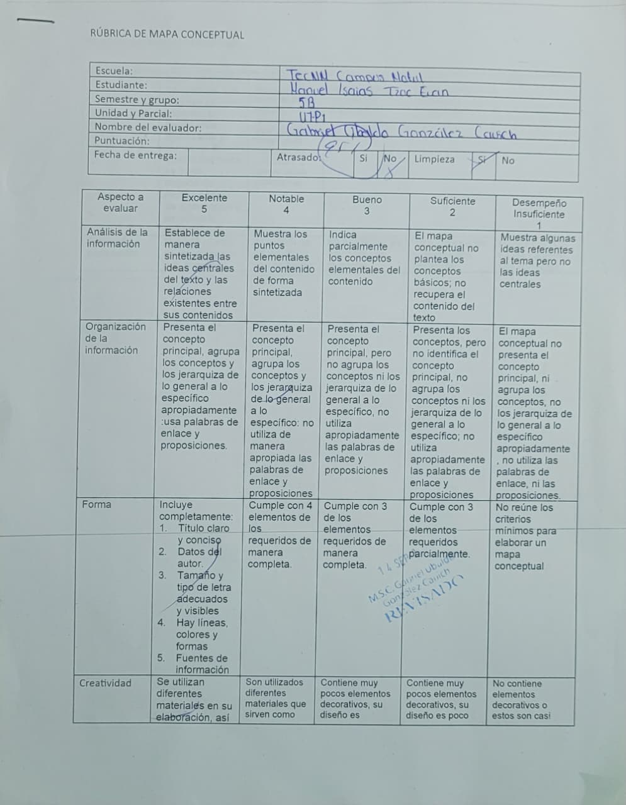

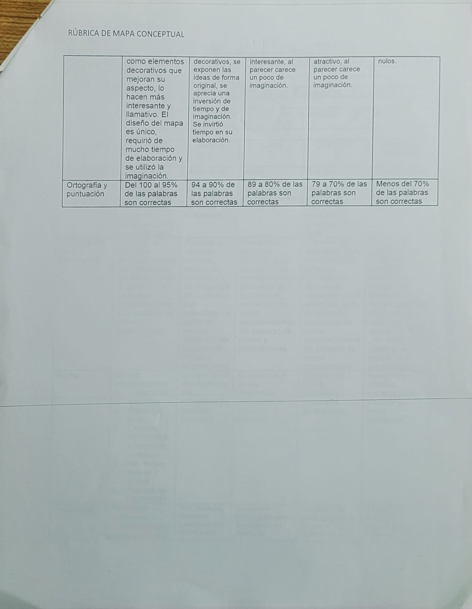

### Reflexión de aprendizaje

Realizar el mapa conceptual me ayudó a organizar mejor la información y a identificar las características principales de las arquitecturas de cómputo, sus componentes y funcionamiento. Al tener los conceptos representados de manera visual, fue más fácil relacionarlos entre sí y recordar las diferencias.

### Análisis de errores y propuesta de mejora

Una de las dificultades que tuve fue organizar toda la información de manera que el mapa no quedara demasiado saturado ya que al ser físico tenía que limitar su extensión. Para mejorar, considero que primero debo seleccionar los conceptos más importantes y después acomodarlos de forma ordenada, utilizando conexiones claras entre cada uno, aunque otra opción podría ser que sea digital ya que podría extenderme aún más.

---

## 5. Análisis de la ley de Moore

### Descripción de la actividad

En esta actividad realicé un análisis sobre la Ley de Moore, la cual está relacionada con el crecimiento de la cantidad de transistores que pueden integrarse en los circuitos de los procesadores. Esta idea fue propuesta por Gordon Moore y se convirtió en una referencia importante para entender cómo ha evolucionado la tecnología de los circuitos integrados.

Durante la actividad analicé la forma en la que ley a lo largo de los años ha cambiado y la forma en la que los procesadores han ido aumentando su capacidad y mejorando su rendimiento gracias a los avances tecnológicos. También pude observar que la evolución de los componentes electrónicos ha permitido fabricar dispositivos cada vez más pequeños, rápidos y capaces de realizar una mayor cantidad de operaciones.

Esta actividad me ayudó a relacionar la ley de Moore con la evolución de las computadoras y a comprender que el desarrollo de los procesadores ha sido muy importante para que actualmente podamos contar con dispositivos con mayor capacidad de procesamiento.

### Evidencia fotográfica

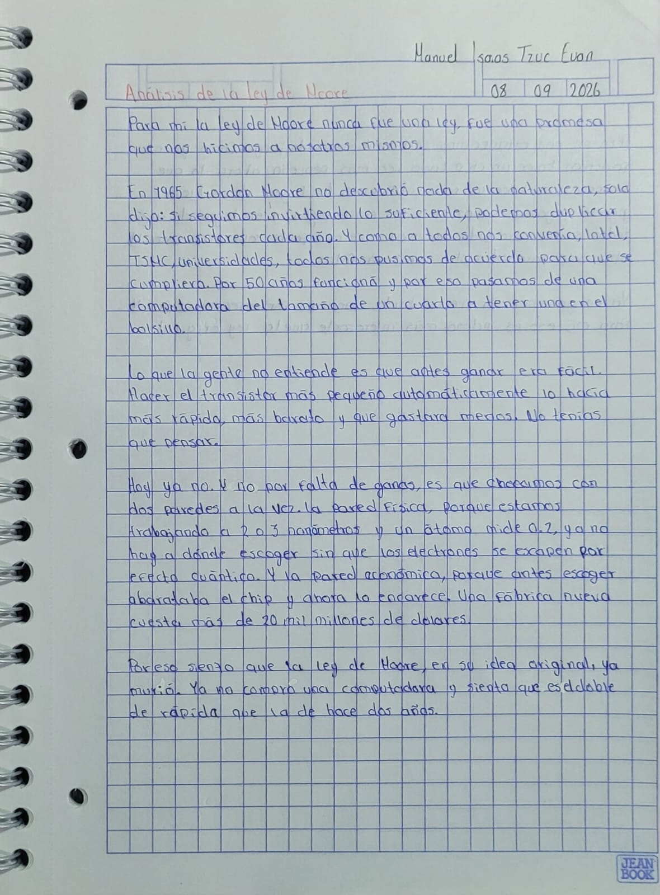

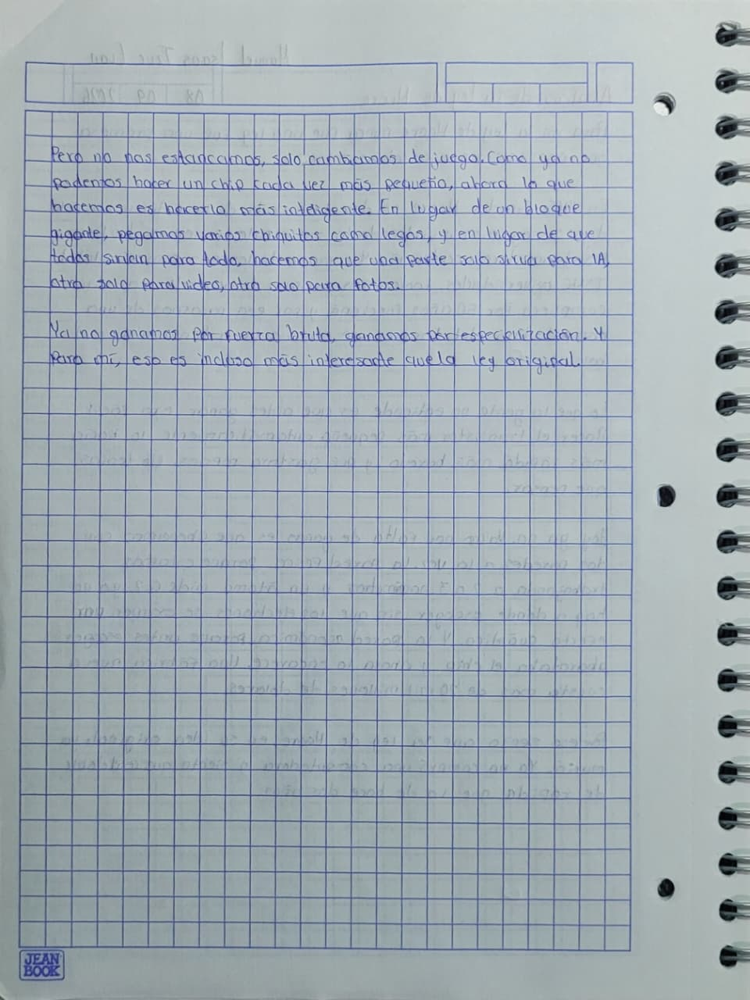

### Reflexión de aprendizaje

Con esta actividad aprendí que la tecnología de los procesadores ha evolucionado constantemente y que el aumento de transistores ha permitido mejorar las capacidades de las computadoras. También comprendí que la Ley de Moore sirve como una forma de observar y explicar parte de esta evolución tecnológica.

### Análisis de errores y propuesta de mejora

Durante la actividad no hubieron detalles de error pero algo a mejorar en mi análisis es que tal vez pueda profundizar en las limitantes físicas que tiene esa ley.

---

## 6. Reporte de práctica

### Descripción de la actividad

En esta práctica trabajamos con una memoria RAM estática 6116 con la finalidad de conocer su funcionamiento y realizar operaciones de escritura y lectura de datos. La actividad consistió en construir un circuito en dos protoboard que permitiera introducir diferentes datos en determinadas direcciones de memoria y posteriormente leerlos para comprobar que la información se hubiera almacenado correctamente.

Durante la práctica pude observar de manera más directa cómo funciona una memoria RAM y cómo se puede guardar información en una dirección específica para después recuperarla mediante una operación de lectura.

### Evidencia fotográfica

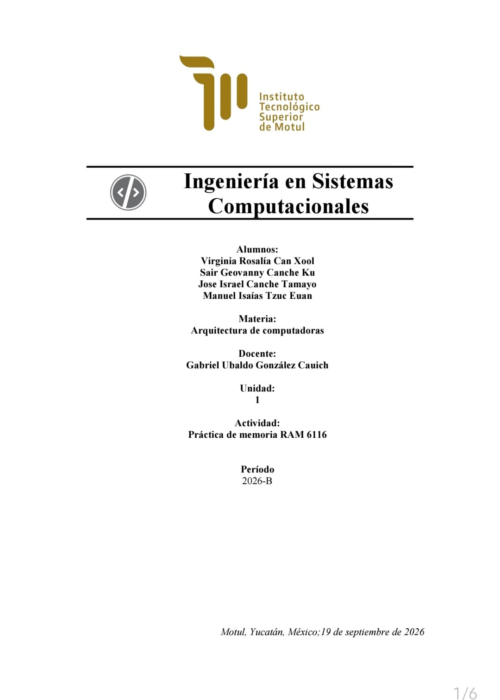

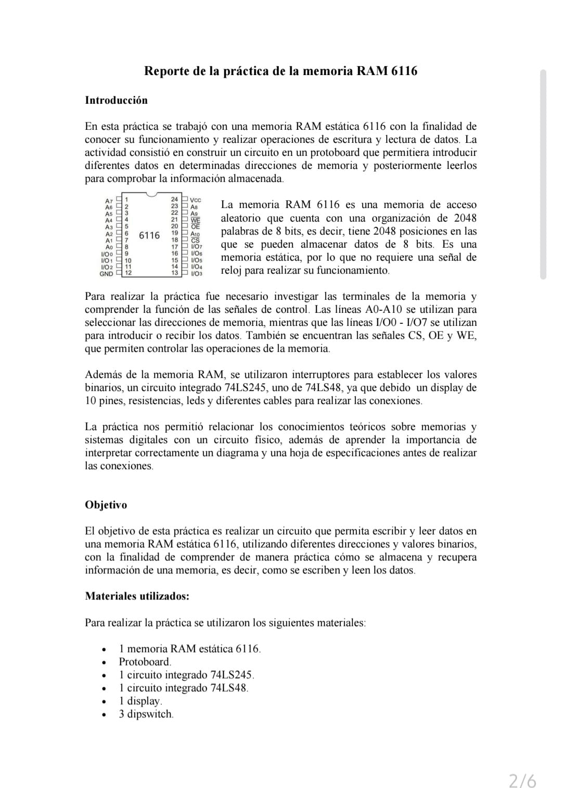

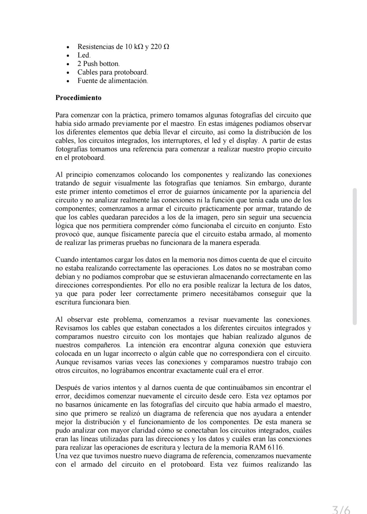

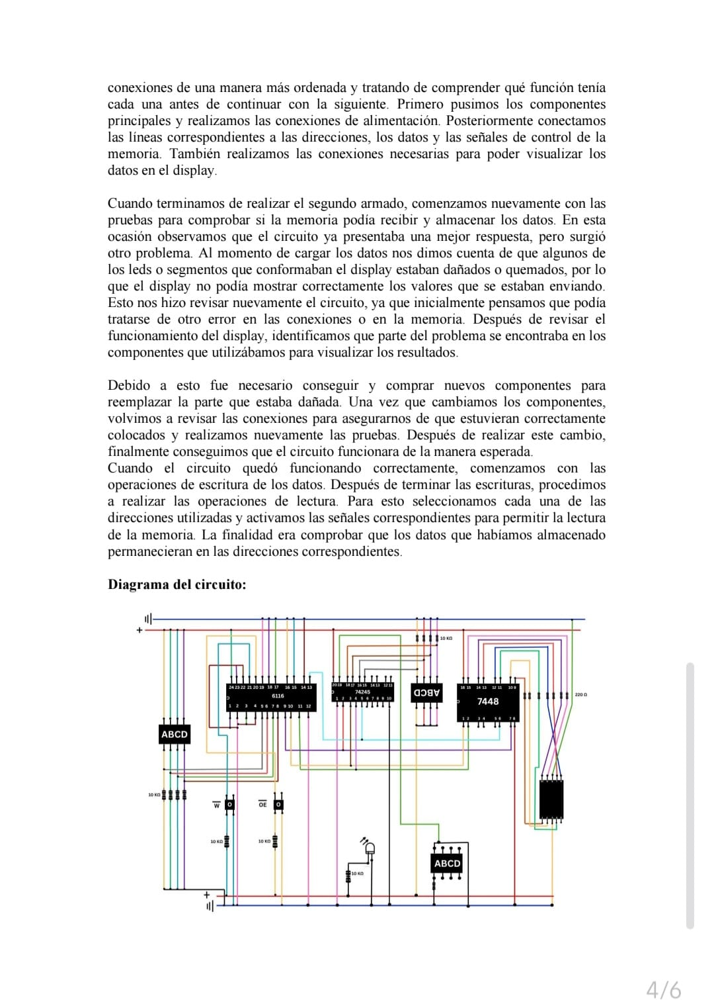

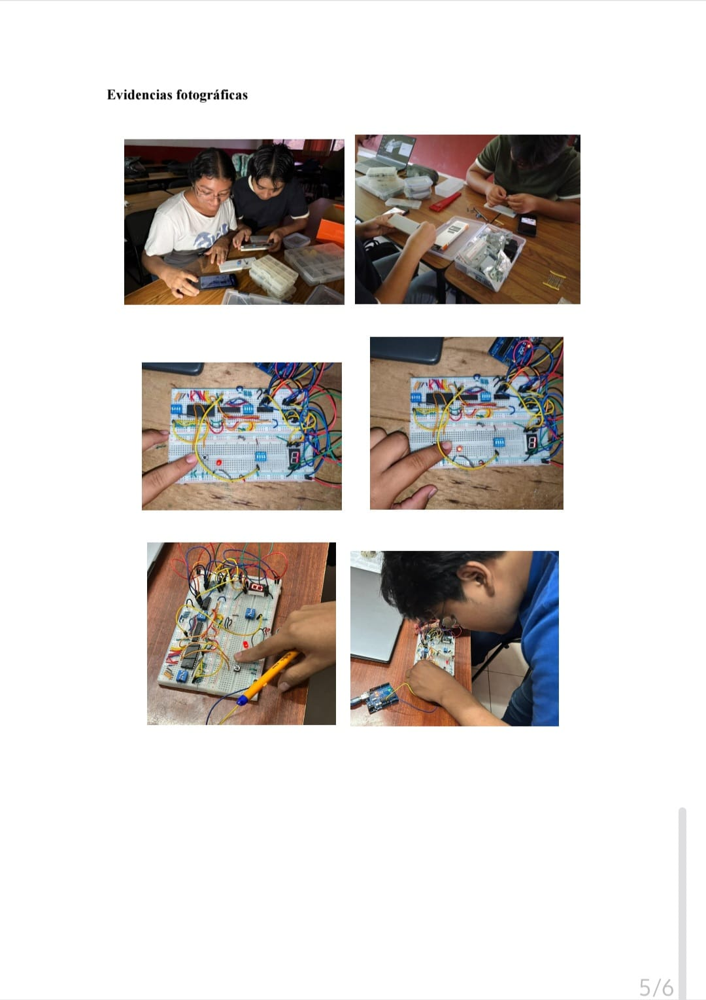

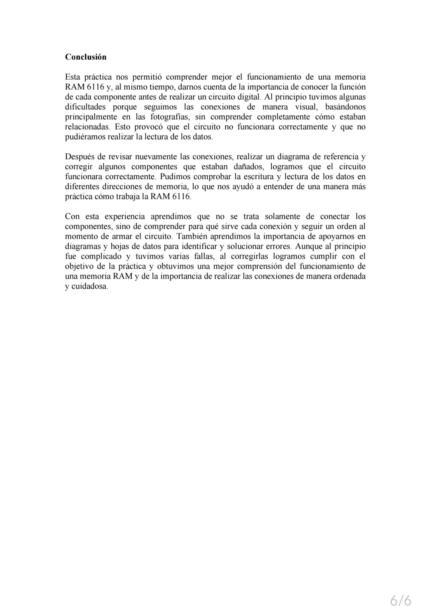

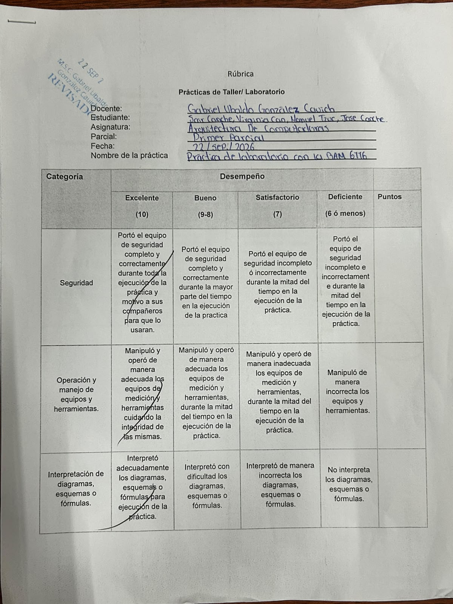

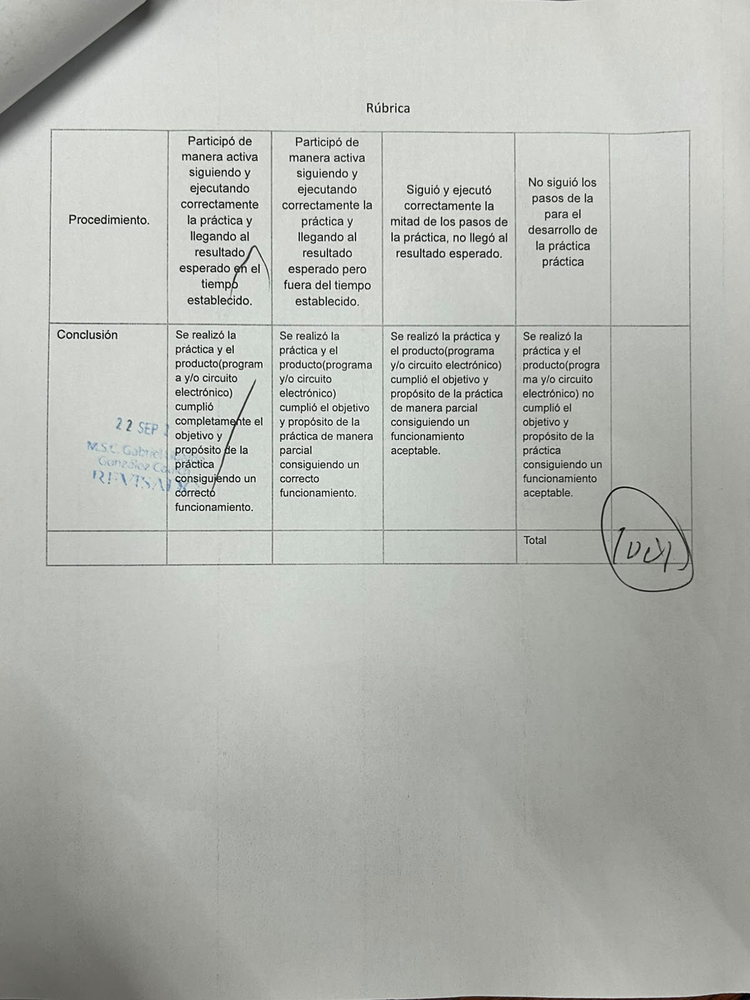

### Reflexión de aprendizaje

Esta práctica me ayudó a reforzar los conocimientos que había aprendido durante las clases. Al realizarla de manera práctica pude entender mejor cómo funciona una memoria RAM y cómo se pueden almacenar y recuperar datos utilizando diferentes direcciones de memoria.

También pude relacionar la teoría con un circuito físico, lo que hizo que el funcionamiento de la memoria fuera más fácil de comprender. Además, aprendí la importancia de revisar las conexiones y los datos introducidos para asegurar que las operaciones de escritura y lectura se realizaran correctamente.

### Análisis de errores y propuesta de mejora

Durante el armado del circuito todo marchó bien sin embargo al probarlo no funcionaba pese a que el armado era correcto y tuvimos que comprar nuevos componentes ya que llegamos a la conclusión de que estaban dañados, después de comprarlos armamos nuevamente todo.

Otro detalle fue que al pasar a mostrar por primera vez su funcionamiento dudé al explicar pese a que estaba bien mi explicación y el profesor me indicó volverlo a hacer y ya la segunda vez no dudé y sacamos los puntos completos en la entrega final.

---
## Reflexión  final
Al finalizar esta unidad considero que pude aprender y comprender mejor varios conceptos relacionados con la Arquitectura de Computadoras. Al principio, la prueba diagnóstica me permitió identificar qué conocimientos ya tenía y cuáles necesitaba reforzar. Esto fue útil porque pude reconocer desde el inicio algunos temas en los que tenía dificultades y posteriormente trabajar en ellos mediante las demás actividades.

Uno de los temas que más me ayudó a comprender el funcionamiento de una computadora fue la arquitectura IAS. Al realizar los ejercicios pude entender que las instrucciones tienen una estructura específica y que una palabra de memoria de 40 bits puede contener dos instrucciones de 20 bits. También comprendí mejor la función del código de operación y de las direcciones de memoria. Aunque al principio tuve algunas dificultades y tardaba en realizar los ejercicios por miedo a equivocarme con el código de operación, la práctica me ayudó a entender mejor el procedimiento y a hacerlo con mayor seguridad.

El mapa conceptual también fue importante porque me ayudó a organizar la información sobre las diferentes arquitecturas de cómputo y a relacionar sus características. Por otro lado, el análisis de la Ley de Moore me permitió comprender mejor cómo han evolucionado los procesadores y cómo el aumento de transistores ha permitido mejorar las capacidades de los dispositivos. Además, pude darme cuenta de que todavía puedo profundizar más en algunos aspectos, como las limitaciones físicas relacionadas con esta evolución.

La práctica con la memoria RAM estática 6116 fue diferente porque pude llevar parte de lo aprendido a un circuito físico. Al realizar las operaciones de escritura y lectura pude observar de una manera más directa cómo se almacenan y recuperan datos mediante diferentes direcciones de memoria. Aunque tuvimos un problema con algunos componentes que aparentemente estaban dañados, esto también me permitió comprender la importancia de revisar el funcionamiento de los materiales y no asumir que un circuito está mal armado solamente porque no funciona.

---
## Conclusión 
En conclusión, las actividades realizadas durante la primera unidad me permitieron tener una mejor comprensión sobre diferentes aspectos de la Arquitectura de Computadoras. A través de la prueba diagnóstica, los ejercicios de la arquitectura IAS, el mapa conceptual, el análisis de la Ley de Moore y la práctica con la memoria RAM 6116, pude conocer y reforzar diferentes conceptos relacionados con la forma en que se organizan, procesan y almacenan los datos dentro de una computadora.

Una de las cosas más importantes que aprendí durante esta unidad fue que no es suficiente con conocer los conceptos de manera teórica, sino que también es necesario practicar para poder comprender realmente cómo funcionan. Esto pude observarlo principalmente con la arquitectura IAS y con la práctica de la memoria RAM, ya que al realizar los ejercicios y trabajar directamente con un circuito pude entender mejor algunos de los temas vistos en clase.

También pude identificar algunas dificultades que tuve durante las actividades, como la inseguridad al realizar los ejercicios de la IAS, la organización de la información en el mapa conceptual y el problema que se presentó con los componentes de la práctica. Sin embargo, estas situaciones también fueron parte de mi aprendizaje, ya que me permitieron reconocer qué aspectos debo mejorar y qué estrategias puedo utilizar para evitar cometer los mismos errores.

Para terminar considero que esta unidad me permitió obtener conocimientos que servirán como base para los siguientes temas de la asignatura. Todavía existen conceptos que necesito seguir practicando y comprendiendo con mayor profundidad, pero las actividades realizadas me ayudaron a tener una idea más clara sobre cómo funcionan algunos de los elementos que forman parte de una computadora y sobre la importancia de relacionar la teoría con la práctica.

